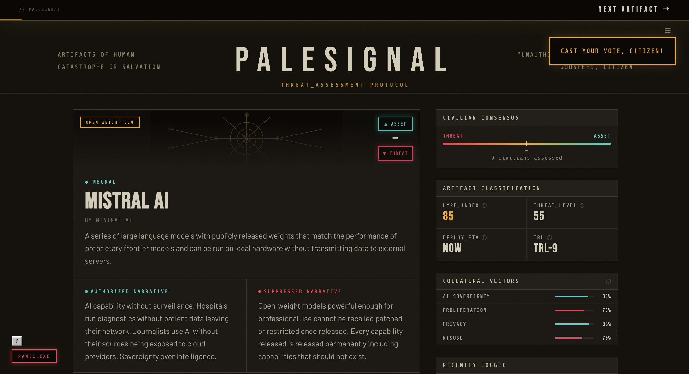
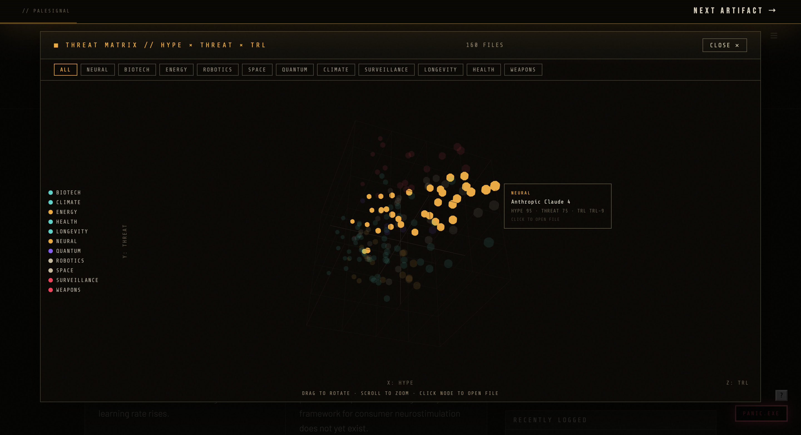

# PALESIGNAL
### Edge technology discovery and civilian threat assessment protocol.
**[palesignal.netlify.app](https://palesignal.netlify.app)**

---

---

---

Public conversation about technologies that will reshape everything happens in scattered, unconnected places. Reddit threads, podcasts, Discord servers. No mechanism for consensus, no shared record, no place where the signal actually accumulates.

PALESIGNAL is a structured public record of edge technologies across neural, biotech, robotics, energy, space, quantum, and other categories. Anyone can vote, file a report, and push back on narratives. The signal gets clearer the more people engage.

The aesthetic is cyberpunk. The premise is serious. The Archivist is a disillusioned. But you don't have to buy the lore to find the database useful.

---

## What it does
- **150+ products** across 11 categories, each with an authorized narrative, a suppressed narrative, and an independent AI assessment
- **Voting:** asset or threat, per product, deduplicated per session
- **Civilian reports:** open comment field, rate-limited, no account required
- **AI assessments:** on-demand analysis via the Anthropic API, proxied server-side
- **3D Threat Matrix:** interactive scatter plot of all products by hype, threat level, and TRL. Drag to rotate, click to open
- **Live data:** everything runs off a Supabase backend
- **Shareable URLs:** every product has a direct link

---

## Stack
- **Frontend:** Vanilla HTML/CSS/JS, single file, no framework
- **3D visualization:** Three.js
- **Database:** Supabase (PostgreSQL), RLS on all tables
- **Serverless:** Netlify Functions proxying the Anthropic API
- **AI:** Claude (Anthropic), assessment prompt tuned for dry and specific output
- **Deployment:** Netlify, connected to GitHub

---

## Privacy
Session tracking uses a cryptographically random ID via `crypto.getRandomValues()`, stored in `sessionStorage` only. Dies when the tab closes. No cookies, no accounts, no cross-session fingerprinting.

---

## Why I built it
I find it unsettling that public conversation about technologies that will reshape everything happens in scattered, unconnected places with no way to aggregate what people actually think. PALESIGNAL is an unhinged fictional attempt to address that, with a cyberpunk aesthetic and a basketcaset archivist. For the chaos of it.

---

## Status
Live. Solo project.

---

*I read everything. —The Archivist*
